

# 👋 Hi, I'm Nishit Soni
### Data Scientist | AI Engineer | 3rd Year B.Tech (ELCE) @ ABES EC

---

"Turning complex datasets into intelligent solutions and visual stories."

## 👨‍💻 Professional Summary
I am a driven engineering student with a **8.17 CGPA**, bridging the gap between **Electrical Engineering** and **Advanced Data Science**. I specialize in **Generative AI**, **Cloud-based ML deployment**, and **Data Analytics**.

* 🏆 **Top 10 Finalist** @ Microsoft Hackathon for designing real-time analytics systems.
* 🤖 **IBM Certified** in Prompt Engineering for Everyone.
* 📊 **Tata GenAI Graduate** – Completed job simulation for AI-powered data analytics and risk profiling.
* 🥇 **250+ Problems Solved** on CodeChef with consistent 100-day streaks.

---

## 🛠️ Technical Toolkit

| Category | Skills & Tools |
| :--- | :--- |
| **Languages** | Python (Primary), SQL, R, C++, Java |
| **AI & ML** | Regression, Classification, NLP, CNN, ANN |
| **Data Tools** | Pandas, NumPy, Scikit-learn, TensorFlow, PyTorch |
| **Visualization** | Power BI, Tableau, Excel |
| **Cloud/DB** | AWS, Snowflake, Google Big Query, MySQL |

---

## 📄 Resume & Curriculum Vitae
Need a hard copy of my professional background? You can view or download my resume below:

  

---

## 🏆 Hackathons & Innovations
Real-world problem solving through competitive innovation.

<table border="0">
  <tr>
    <td align="center">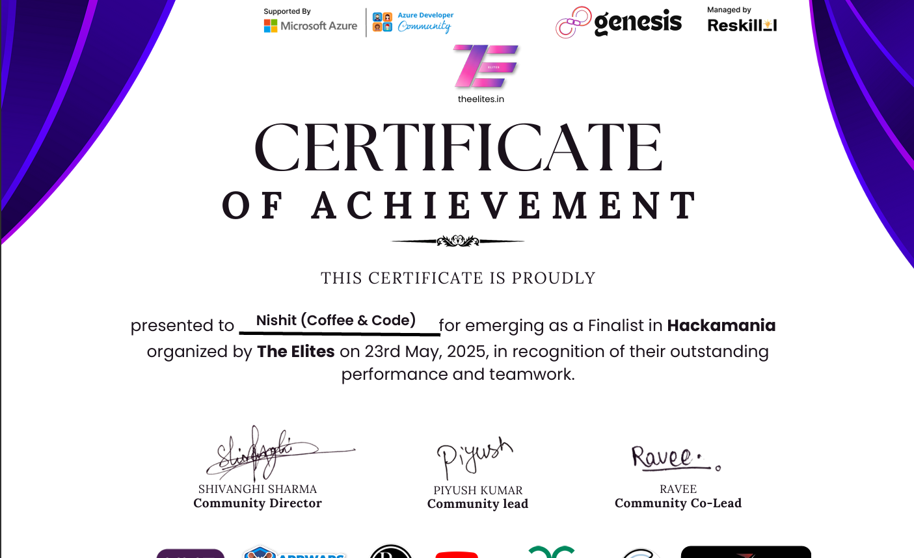 <b>Microsoft Hackathon Finalist</b></td>
    <td align="center">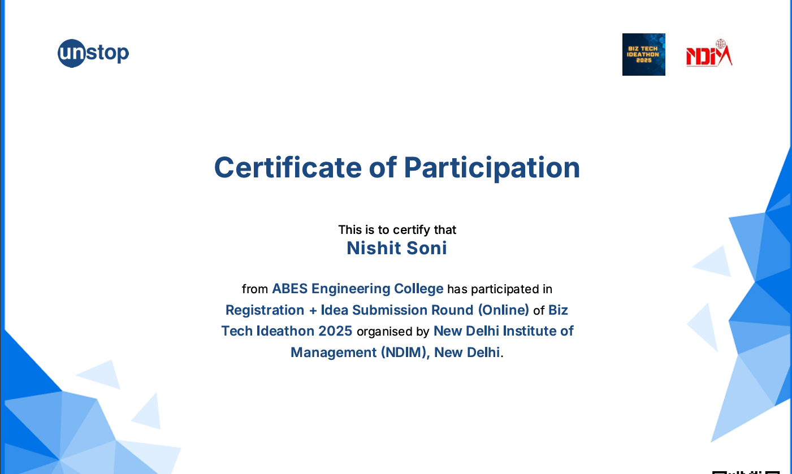 <b>Biz Tech Ideathon 2025</b></td>
    <td align="center">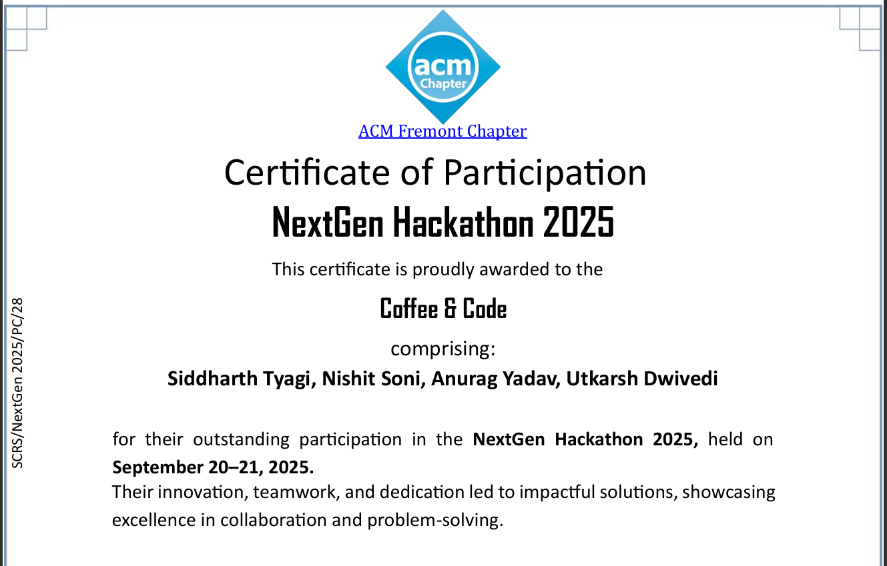 <b>NextGen Hackathon 2025</b></td>
  </tr>
</table>

---

## 🎓 Skill Certificates & CISCO Badges
Verified expertise in Data Science, Cloud, and Networking.

<table border="0">
  <tr>
    <td align="center">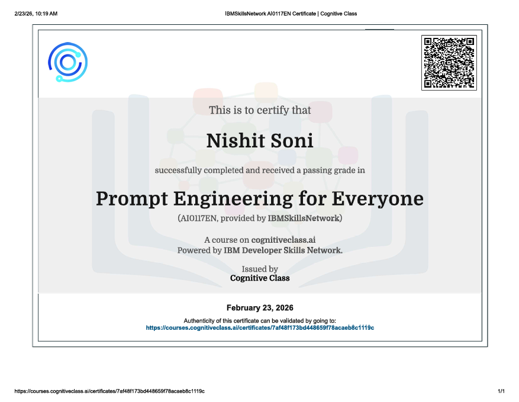 <b>IBM Prompt Engineering</b></td>
    <td align="center">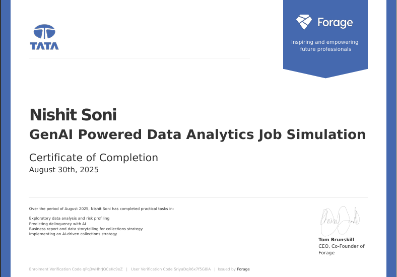 <b>Tata Data Analytics</b></td>
    <td align="center">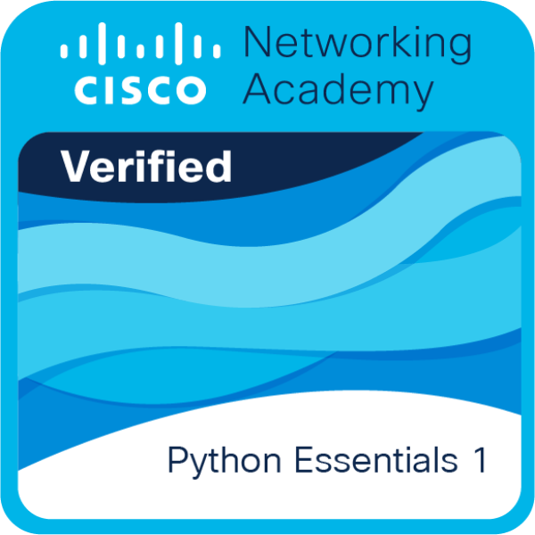 <b>CISCO Python Essentials</b></td>
  </tr>
  <tr>
    <td align="center">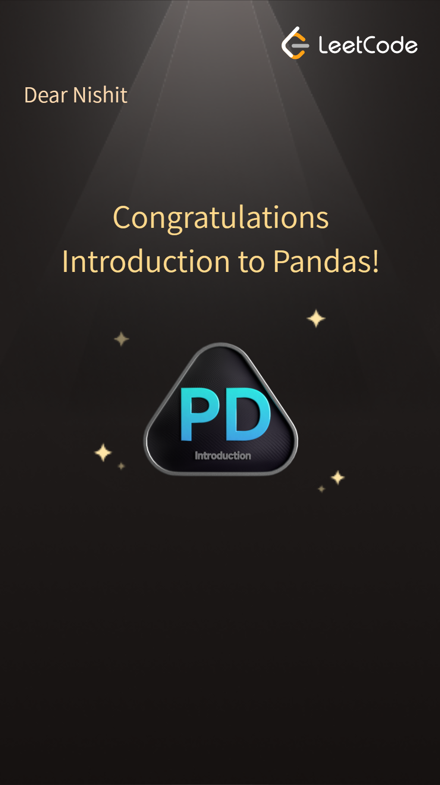 <b>Introduction to Pandas</b></td>
    <td align="center">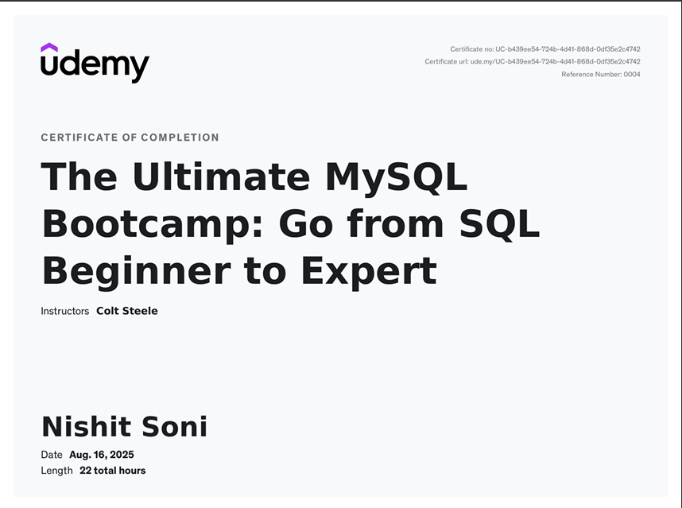 <b>SQL Expert (Udemy)</b></td>
    <td align="center">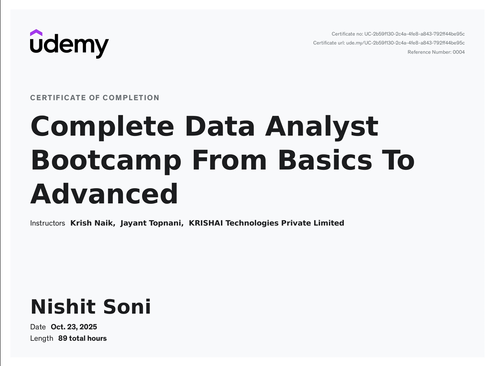 <b>Data Analyst Bootcamp</b></td>
  </tr>
</table>

---

## 🥇 Coding Milestones (LeetCode & CodeChef)
A testament to my daily commitment to algorithmic problem solving.

<table border="0">
  <tr>
    <td align="center">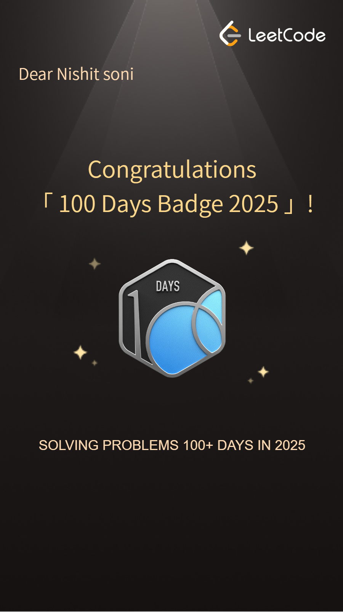 <b>100 Days LeetCode</b></td>
    <td align="center">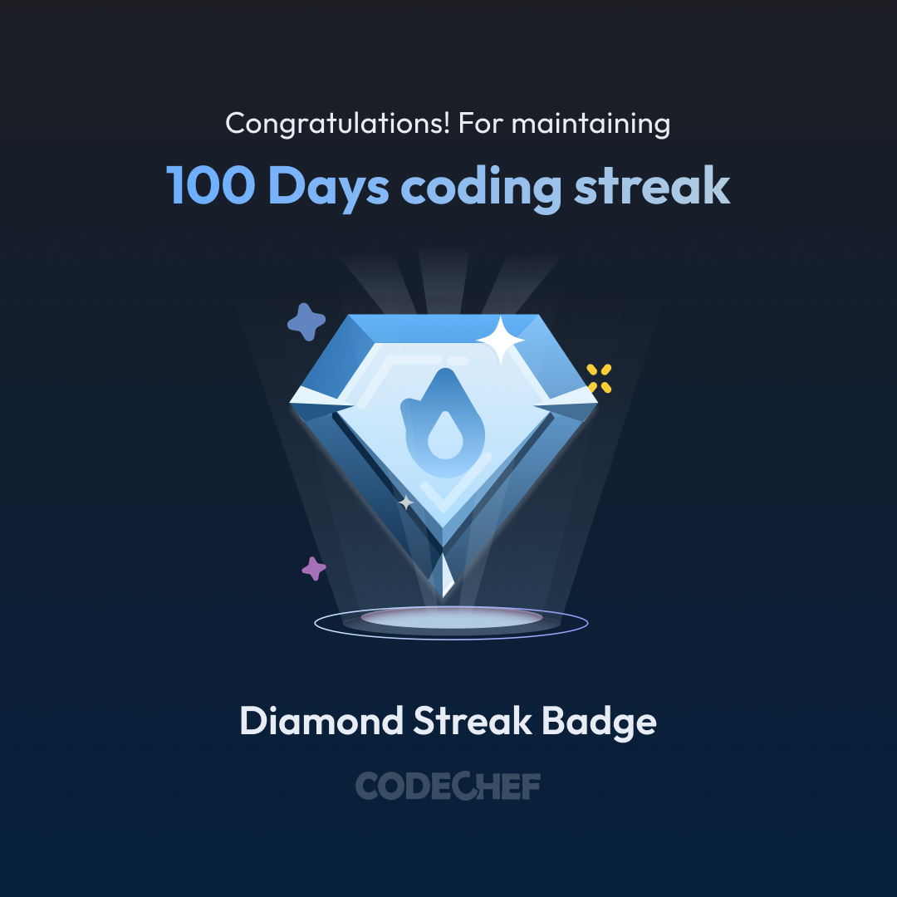 <b>CodeChef Diamond Streak</b></td>
    <td align="center"> <b>250+ Problems Solved</b></td>
  </tr>
</table>

---

## 🎨 Beyond the Code
* **Sketching:** Lead artist @ "Integral of Shades" (Instagram).
* **Poetry:** Original Hindi & Urdu compositions.
* **Music:** Passionate guitar player.

  
   
  Built with ❤️ by Nishit Soni

