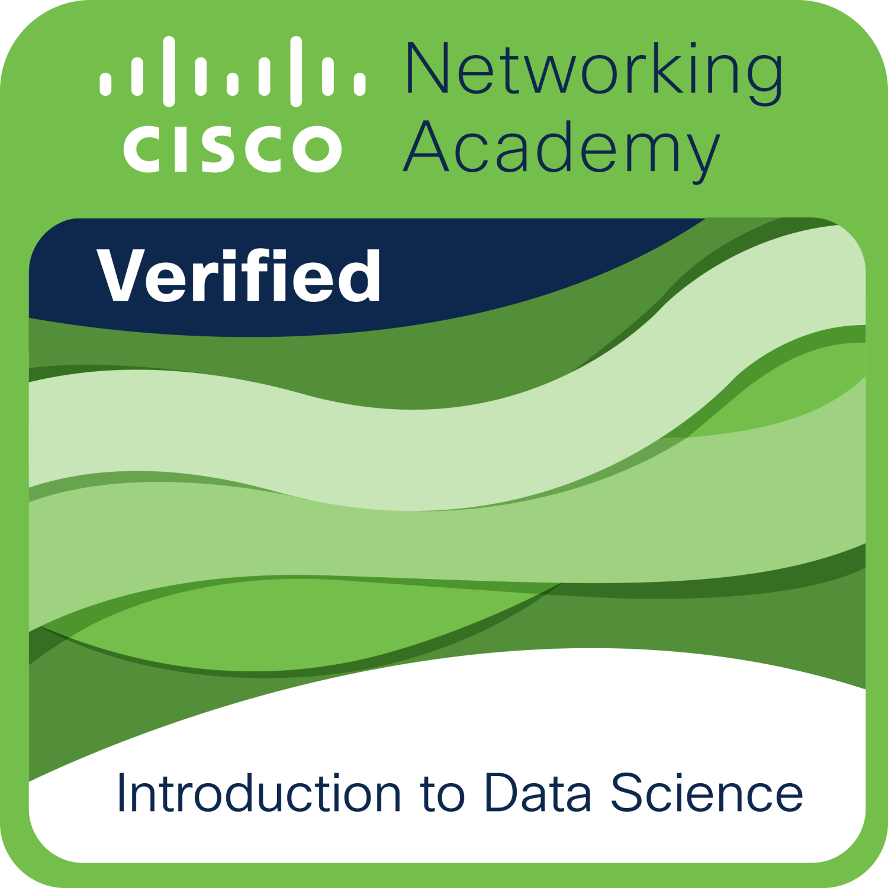
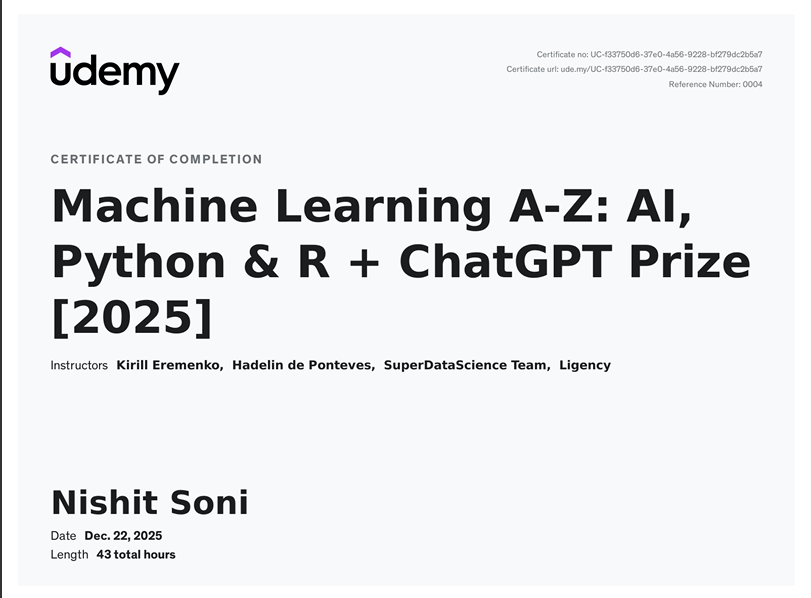
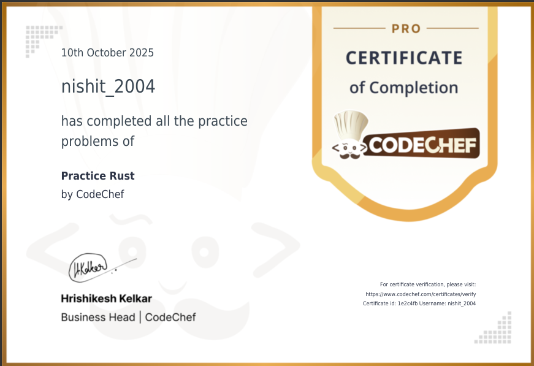
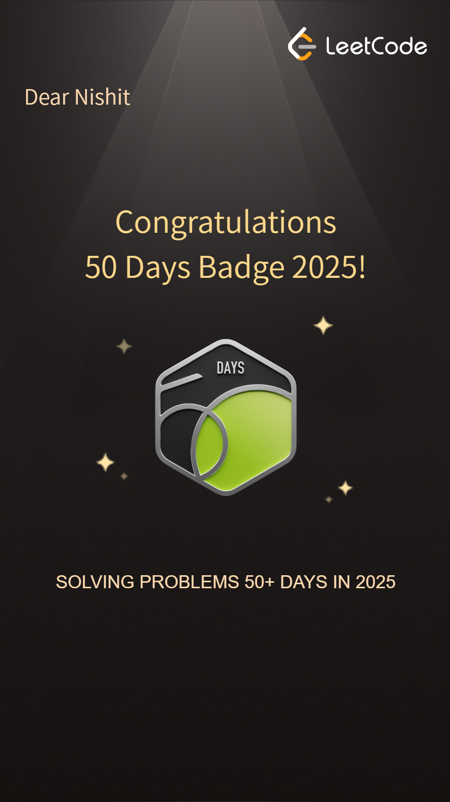
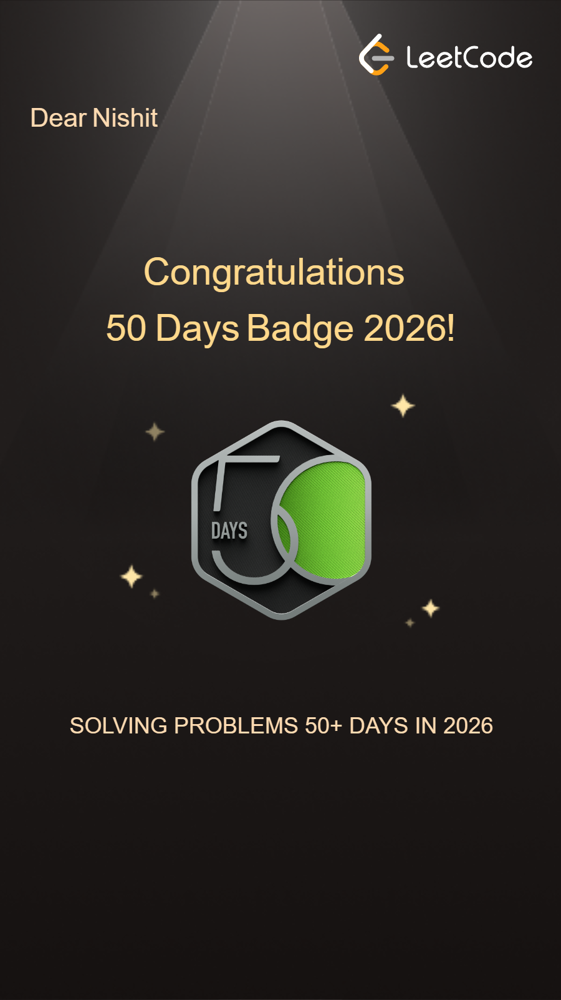
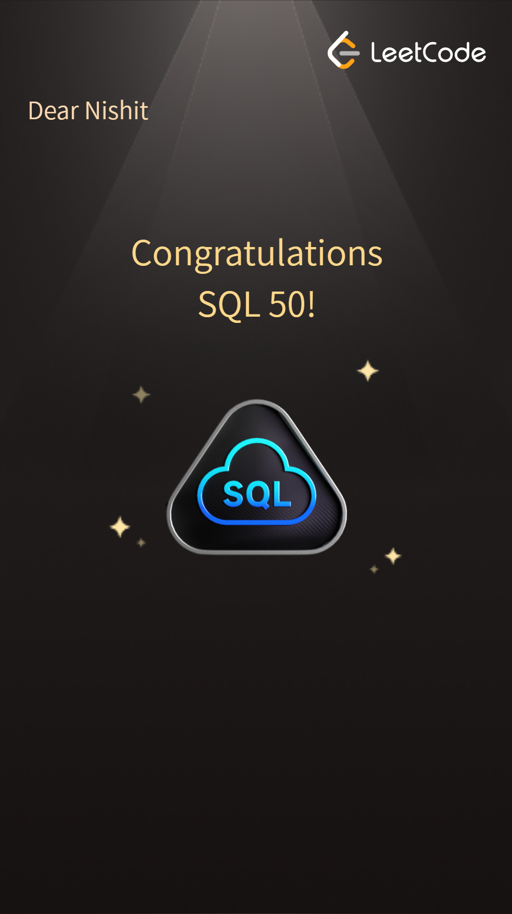
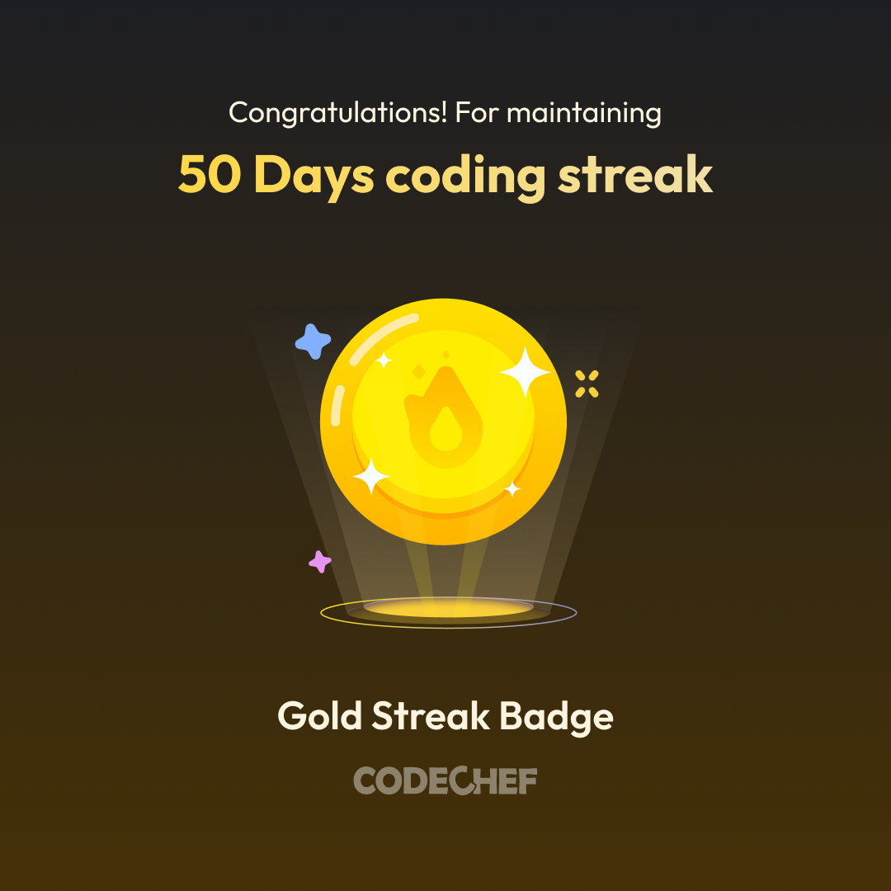
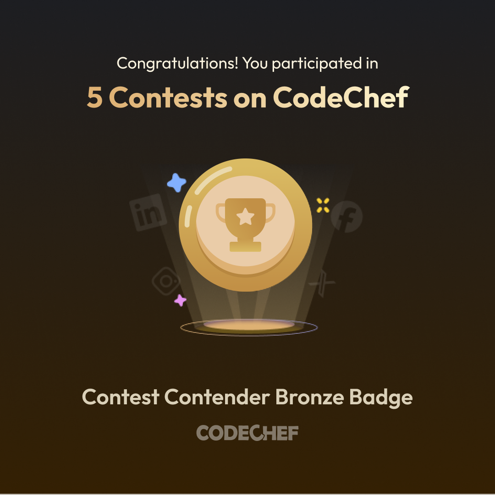

  

  

  
  
  
  
  
  

 

## 🚀 About Me

I am a driven B.Tech ELCE student (CGPA: 8.17) with a deep focus on **Machine Learning, Data Science, and Cloud Architecture**. From engineering real-time fraud detection systems to building predictive environmental models, I thrive at the intersection of complex data and actionable insights. I actively participate in competitive programming using Java and DSA, and I am passionate about creating efficient backend architectures.

### 🎭 Hobbies & Interests
Beyond the terminal, I believe in the fusion of logic and creativity:
- ✏️ **Sketching:** I am a visual artist specializing in advanced pencil sketching and shading. I manage an art platform called *Integral of Shades*.
- 🎸 **Playing Guitar:** I’m a self-taught guitarist who loves playing music
- ✍️ **Poetry:** I also write original Hindi and Urdu poetry, often authoring pieces for college events.

---

## 🛠️ Technical Arsenal

### **Languages & Core**

  
  
  
  
  

### **Machine Learning & AI**

  
  
  
  
  

### **Cloud, BI & Databases**

  
  
  
  
  

---

## 💻 Featured Projects & Systems

* **Sentinel Fraud Detection Engine:** Engineered a financial risk assessment architecture and deployed it seamlessly on AWS.
* **Smart Patient Triage System:** Developed an ML-driven application designed to prioritize patients dynamically based on symptom severity, packaged and deployed via Streamlit.
* **Cloud-Based BI Integrations:** Created comprehensive dashboards leveraging Snowflake, BigQuery, AWS, and Azure for deep loan, product, and housing data analysis.
* **SQL-Integrated Web Application:** Built a real-time web app with MySQL backend integration to efficiently capture user inputs and improve data accessibility.
* **Exploratory Data Analysis Engine:** Engineered features and applied advanced visualizations on datasets including Play Store metrics, Red Wine quality, and Flight Prices using Python and Pandas.
* **Algerian Forest Fire Predictor:** Designed an environmental risk modeling project utilizing regression algorithms to predict potential fire outbreaks.

---
---

## 📄 Resume & Curriculum Vitae
Need a hard copy of my professional background? You can view or download my resume below:

  

---

## 🏆 Hackathons & Innovations
Real-world problem solving through competitive innovation.

<table border="0">
  <tr>
    <td align="center"> <b>Microsoft Hackathon Finalist</b></td>
    <td align="center"> <b>International level Hackathon Finalist</b></td>
    <td align="center"> <b>Biz Tech Ideathon 2025</b></td>
    <td align="center"> <b>NextGen Hackathon 2025</b></td>
  </tr>
</table>

---

## 🎓 Skill Certificates & CISCO Badges
Verified expertise in Data Science, Cloud, and Networking.

<table border="0">
  <tr>
    <td align="center"> <b>IBM Prompt Engineering</b></td>
    <td align="center"> <b>Tata Data Analytics</b></td>
    <td align="center"> <b>CISCO Python Essentials</b></td>
    <td align="center"> <b>CISCO Introduction to Data Science</b></td>
  </tr>
  <tr>
    <td align="center"> <b>SQL Expert </b></td>
    <td align="center"> <b>Data Analyst Bootcamp</b></td>
    <td align="center"> <b>Machine Learning </b></td>
    <td align="center"> <b> Rust </b></td>
    
  </tr>
</table>

---

## 🥇 Coding Milestones (LeetCode & CodeChef)
A testament to my daily commitment to algorithmic problem solving.

<table border="0">
  <tr>
    <td align="center"> <b>100 Days LeetCode</b></td>
    <td align="center"> <b>50 Days LeetCode 2025</b></td>
    <td align="center"> <b>50 Days LeetCode 2026</b></td>
    <td align="center"> <b>50 Days SQL LeetCode </b></td>
    <td align="center"> <b>Introduction to Pandas</b></td>
    <td align="center"> <b>CodeChef Diamond Streak</b></td>
    <td align="center"> <b>CodeChef Diamond Streak</b></td>
    
  </tr>

  <tr>
    <td align="center"> <b>CodeChef 250 problem badge</b></td>
    <td align="center"> <b>CodeChef Diamond Streak</b></td>
    <td align="center"> <b>CodeChef 50 Day Gold Badge</b></td>
    <td align="center"> <b>CodeChef  Bronze Contest Badge</b></td>
    
  </tr>
</table>
---

### ✍️ Quote

## 📊 GitHub Analytics

  
  

 

  

 

  <h3>🐍 My Code Contribution Snake</h3>
  <picture>
    <source media="(prefers-color-scheme: dark)" srcset="https://raw.githubusercontent.com/Nishit-soni-01/Nishit-soni-01/output/github-contribution-grid-snake-dark.svg">
    <source media="(prefers-color-scheme: light)" srcset="https://raw.githubusercontent.com/Nishit-soni-01/Nishit-soni-01/output/github-contribution-grid-snake.svg">
    
  </picture>

---

  <i>"Transforming complex data into elegant, intelligent solutions."</i>

